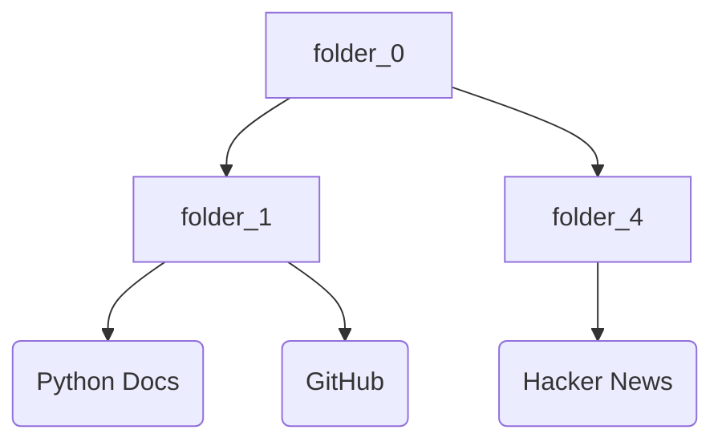

# Техническое Задание: Утилита для экспорта и описания закладок браузера

## 1. Общее описание и цели

Требуется разработать консольную утилиту на Python для автоматической обработки закладок из браузера Chrome. Утилита должна:

- Импортировать JSON-файл закладок Chrome
- Извлекать содержимое веб-страниц по сохраненным ссылкам
- Генерировать краткие описания страниц в Markdown формате с использованием любого провайдера, поддерживающего OpenAI API (включая OpenRouter)
- Создавать Mermaid-диаграммы для визуализации структуры закладок
- Сохранять результаты в файловую структуру, соответствующую иерархии исходных закладок
- Обеспечить полную настройку через .env-файл
- Содержать русскоязычные комментарии во всех файлах

Основная цель — создание текстовой базы знаний из накопленных закладок с возможностью быстрого поиска и навигации.

## 2. Архитектура системы

### 2.1 Компоненты системы

Система состоит из шести основных компонентов:

**ConfigManager** — управление конфигурацией через .env-файл с валидацией параметров
**BookmarkParser** — парсинг JSON-файла закладок Chrome и построение древовидной структуры
**ContentFetcher** — получение HTML-содержимого веб-страниц с обработкой ошибок и rate limiting
**ContentSummarizer** — взаимодействие с OpenAI-совместимым API для генерации описаний
**DiagramGenerator** — создание Mermaid-диаграмм структуры закладок
**FileSystemWriter** — создание файловой структуры и сохранение Markdown-файлов

### 2.2 Поток данных

```
.env → ConfigManager → JSON Bookmarks → BookmarkParser → ContentFetcher → ContentSummarizer → FileSystemWriter → Markdown Files
                                                      ↓
                                              DiagramGenerator → Mermaid Diagram
```

1. Загрузка конфигурации из .env-файла с валидацией обязательных параметров
2. Загрузка и валидация JSON-файла закладок
3. Генерация Mermaid-диаграммы структуры закладок
4. Рекурсивный обход древовидной структуры закладок
5. Для каждой ссылки: извлечение HTML → очистка текста → генерация описания через LLM API
6. Создание папок согласно иерархии закладок
7. Сохранение Markdown-файлов с нормализованными именами

### 2.3 Технологический стек

- **Язык**: Python 3.9+
- **HTTP-клиент**: httpx (асинхронные запросы)
- **Парсинг HTML**: BeautifulSoup4
- **LLM интеграция**: openai (официальная библиотека, совместима с OpenRouter)
- **Диаграммы**: mermaid-py для генерации Mermaid-диаграмм
- **Конфигурация**: python-dotenv для управления .env-файлом
- **CLI**: argparse
- **Логирование**: logging (стандартная библиотека)


### 2.4 Нефункциональные требования

**Производительность**

- Асинхронная обработка до 10 страниц параллельно
- Таймаут на запрос веб-страницы: 30 секунд (настраивается через .env)
- Rate limiting для LLM API: настраивается через .env (по умолчанию 3 запроса в минуту)

**Надежность**

- Обработка HTTP-ошибок (4xx, 5xx)
- Retry-механизм для временных сбоев (3 попытки с экспоненциальной задержкой)
- Graceful degradation при недоступности LLM API

**Безопасность**

- Все чувствительные данные (API-ключи, URL) хранятся в .env-файле
- .env-файл добавлен в .gitignore
- Валидация URL перед запросами
- Ограничение размера загружаемого контента (максимум 5 МБ, настраивается через .env)

**Масштабируемость**

- Поддержка обработки до 10,000 закладок
- Инкрементальное выполнение с сохранением прогресса
- Возможность продолжения прерванной обработки


### 2.5 Конфигурация через .env-файл

Все параметры приложения настраиваются через .env-файл:

```env
# LLM API Configuration
LLM_API_KEY=sk-or-v1-...
LLM_BASE_URL=https://openrouter.ai/api/v1
LLM_MODEL=openai/gpt-4o-mini
LLM_MAX_TOKENS=1000
LLM_TEMPERATURE=0.7
LLM_RATE_LIMIT=3

# Fetcher Configuration
FETCH_TIMEOUT=30
FETCH_MAX_CONCURRENT=10
FETCH_MAX_SIZE_MB=5
FETCH_RETRY_ATTEMPTS=3
FETCH_RETRY_DELAY=1.5

# Output Configuration
OUTPUT_DIR=./bookmarks_export
MARKDOWN_INCLUDE_METADATA=true
GENERATE_MERMAID_DIAGRAM=true

# Prompt Configuration
PROMPT_FILE=./prompts/summarize_prompt.txt

# Logging Configuration
LOG_LEVEL=INFO
LOG_FILE=./bookmarks_export.log
```


## 3. Детализация реализации

### 3.1 Структура проекта

```
bookmark_summarizer/
├── src/
│   ├── __init__.py
│   ├── main.py              # Главный модуль запуска
│   ├── config.py            # Управление конфигурацией
│   ├── parser.py            # Парсинг JSON закладок
│   ├── fetcher.py           # Загрузка веб-страниц
│   ├── summarizer.py        # Генерация описаний через LLM
│   ├── diagram.py           # Генерация Mermaid-диаграмм
│   ├── writer.py            # Запись файлов
│   └── models.py            # Модели данных
├── prompts/
│   └── summarize_prompt.txt # Промпт для LLM
├── tests/
│   ├── __init__.py
│   ├── test_config.py
│   ├── test_parser.py
│   ├── test_fetcher.py
│   ├── test_summarizer.py
│   ├── test_diagram.py
│   └── test_writer.py
├── .env.example             # Шаблон конфигурации
├── .env                     # Реальная конфигурация (в .gitignore)
├── .gitignore
├── requirements.txt
├── README.md
└── setup.py
```


### 3.2 Модели данных

```python
# models.py
"""
Модуль models.py
Содержит модели данных для работы с закладками браузера.
Используется dataclass для удобного представления структур.
"""

from dataclasses import dataclass
from typing import List, Optional
from datetime import datetime

@dataclass
class Bookmark:
    """
    Класс для представления одной закладки.
    
    Атрибуты:
        title: Заголовок закладки
        url: URL-адрес страницы
        date_added: Дата добавления закладки
    """
    title: str
    url: str
    date_added: Optional
    
@dataclass
class BookmarkFolder:
    """
    Класс для представления папки с закладками.
    Поддерживает вложенную структуру папок.
    
    Атрибуты:
        name: Название папки
        children: Список вложенных папок
        bookmarks: Список закладок в папке
    """
    name: str
    children: List
    bookmarks: List
    
@dataclass
class ProcessedPage:
    """
    Класс для представления обработанной страницы.
    
    Атрибуты:
        url: URL-адрес страницы
        title: Заголовок страницы
        summary: Сгенерированное описание
        fetch_date: Дата обработки
        status: Статус обработки ('success', 'failed', 'skipped')
    """
    url: str
    title: str
    summary: str
    fetch_date: datetime
    status: str
```


### 3.3 Модуль config.py

**Класс ConfigManager**

```python
# config.py
"""
Модуль config.py
Управляет конфигурацией приложения через .env-файл.
Обеспечивает валидацию и доступ к параметрам конфигурации.
"""

from dataclasses import dataclass
from typing import Optional
import os
from dotenv import load_dotenv

@dataclass
class Config:
    """
    Класс конфигурации приложения.
    Все поля загружаются из .env-файла.
    """
    # LLM API настройки
    llm_api_key: str
    llm_base_url: str
    llm_model: str
    llm_max_tokens: int
    llm_temperature: float
    llm_rate_limit: int
    
    # Настройки загрузки контента
    fetch_timeout: int
    fetch_max_concurrent: int
    fetch_max_size_mb: int
    fetch_retry_attempts: int
    fetch_retry_delay: float
    
    # Настройки вывода
    output_dir: str
    markdown_include_metadata: bool
    generate_mermaid_diagram: bool
    
    # Путь к файлу с промптом
    prompt_file: str
    
    # Настройки логирования
    log_level: str
    log_file: str

class ConfigManager:
    """
    Менеджер конфигурации приложения.
    Загружает параметры из .env-файла и предоставляет валидацию.
    """
    
    def __init__(self, env_path: Optional = None):
        """
        Инициализация менеджера конфигурации.
        
        Аргументы:
            env_path: Путь к .env-файлу (по умолчанию .env в корне проекта)
        """
        load_dotenv(env_path or '.env')
        self.config = self._load_config()
        self._validate_config()
    
    def _load_config(self) -> Config:
        """
        Загружает конфигурацию из переменных окружения.
        
        Возвращает:
            Config: Объект с загруженной конфигурацией
        """
        return Config(
            llm_api_key=os.getenv('LLM_API_KEY', ''),
            llm_base_url=os.getenv('LLM_BASE_URL', 'https://api.openai.com/v1'),
            llm_model=os.getenv('LLM_MODEL', 'gpt-4o-mini'),
            llm_max_tokens=int(os.getenv('LLM_MAX_TOKENS', '1000')),
            llm_temperature=float(os.getenv('LLM_TEMPERATURE', '0.7')),
            llm_rate_limit=int(os.getenv('LLM_RATE_LIMIT', '3')),
            
            fetch_timeout=int(os.getenv('FETCH_TIMEOUT', '30')),
            fetch_max_concurrent=int(os.getenv('FETCH_MAX_CONCURRENT', '10')),
            fetch_max_size_mb=int(os.getenv('FETCH_MAX_SIZE_MB', '5')),
            fetch_retry_attempts=int(os.getenv('FETCH_RETRY_ATTEMPTS', '3')),
            fetch_retry_delay=float(os.getenv('FETCH_RETRY_DELAY', '1.5')),
            
            output_dir=os.getenv('OUTPUT_DIR', './bookmarks_export'),
            markdown_include_metadata=os.getenv('MARKDOWN_INCLUDE_METADATA', 'true').lower() == 'true',
            generate_mermaid_diagram=os.getenv('GENERATE_MERMAID_DIAGRAM', 'true').lower() == 'true',
            
            prompt_file=os.getenv('PROMPT_FILE', './prompts/summarize_prompt.txt'),
            
            log_level=os.getenv('LOG_LEVEL', 'INFO'),
            log_file=os.getenv('LOG_FILE', './bookmarks_export.log')
        )
    
    def _validate_config(self):
        """
        Валидирует обязательные параметры конфигурации.
        Вызывает исключение при отсутствии критичных параметров.
        
        Raises:
            ValueError: Если отсутствуют обязательные параметры
        """
        if not self.config.llm_api_key:
            raise ValueError("LLM_API_KEY не задан в .env-файле")
        
        if not os.path.exists(self.config.prompt_file):
            raise ValueError(f"Файл промпта не найден: {self.config.prompt_file}")
    
    def get(self) -> Config:
        """
        Возвращает объект конфигурации.
        
        Возвращает:
            Config: Объект с конфигурацией
        """
        return self.config
```

Методы:

- `__init__(env_path: Optional
- `_load_config() -> Config` — чтение переменных окружения
- `_validate_config()` — проверка обязательных параметров
- `get() -> Config` — получение объекта конфигурации


### 3.4 Модуль parser.py

**Класс BookmarkParser**

```python
# parser.py
"""
Модуль parser.py
Обеспечивает парсинг JSON-файлов закладок браузера Chrome.
Строит древовидную структуру папок и закладок.
"""
```

Методы:

- `load_json(file_path: str) -> dict` — загрузка и валидация JSON
- `parse_bookmarks(data: dict) -> BookmarkFolder` — построение дерева закладок
- `_traverse_node(node: dict, parent: BookmarkFolder) -> None` — рекурсивный обход узлов

Алгоритм:

1. Чтение JSON-файла с обработкой encoding (UTF-8)
2. Валидация структуры (проверка обязательных полей: roots, bookmark_bar)
3. Рекурсивный обход начиная с roots.bookmark_bar
4. Разделение узлов на folder и url типы
5. Построение древовидной структуры BookmarkFolder

Все функции содержат docstring на русском языке с описанием параметров и возвращаемых значений.

### 3.5 Модуль fetcher.py

**Класс ContentFetcher**

```python
# fetcher.py
"""
Модуль fetcher.py
Отвечает за загрузку HTML-контента веб-страниц.
Поддерживает асинхронные запросы, retry-механизм и rate limiting.
"""
```

Методы:

- `__init__(config: Config)` — инициализация с параметрами из конфигурации
- `async fetch_content(url: str) -> Optional
- `extract_text(html: str) -> str` — извлечение текста из HTML
- `_validate_url(url: str) -> bool` — проверка URL
- `_retry_with_backoff(func, max_retries: int = 3)` — retry-логика

Ключевые особенности:

- Использование httpx.AsyncClient с connection pooling
- User-Agent для имитации браузера
- Фильтрация JavaScript и CSS
- Извлечение текста из \<article\>, \<main\>, \<p\> тегов
- Ограничение размера ответа (настраивается через FETCH_MAX_SIZE_MB)


### 3.6 Модуль summarizer.py

**Класс ContentSummarizer**

```python
# summarizer.py
"""
Модуль summarizer.py
Взаимодействует с LLM API для генерации описаний страниц.
Поддерживает любые провайдеры с OpenAI-совместимым API (OpenRouter, OpenAI и др.).
"""
```

Методы:

- `__init__(config: Config)` — инициализация с настройками из .env
- `async generate_summary(text: str, title: str) -> str` — генерация описания
- `_load_prompt_template() -> str` — загрузка промпта из файла
- `_prepare_prompt(text: str, title: str) -> str` — формирование промпта
- `_rate_limit()` — контроль частоты запросов

Конфигурация для OpenRouter:

```python
from openai import AsyncOpenAI

client = AsyncOpenAI(
    api_key=config.llm_api_key,
    base_url=config.llm_base_url  # https://openrouter.ai/api/v1
)
```


### 3.7 Файл промпта (prompts/summarize_prompt.txt)

Промпт хранится в отдельном текстовом файле для удобства редактирования:

```
Создай краткое структурированное описание веб-страницы в формате Markdown.

Заголовок страницы: {title}
Содержимое: {content}

Требования:
- Длина: 200-300 слов
- Структура: 
  ## Основная тема
  ## Ключевые моменты (bullet points)
  ## Вывод
- Язык: русский
- Стиль: информативный, структурированный

Создай описание строго следуя этой структуре.
```


### 3.8 Модуль diagram.py

**Класс DiagramGenerator**

```python
# diagram.py
"""
Модуль diagram.py
Генерирует Mermaid-диаграммы для визуализации структуры закладок.
Использует библиотеку mermaid-py для создания диаграмм.
"""

from mermaid import Mermaid
from mermaid.graph import Graph
from models import BookmarkFolder
from typing import List

class DiagramGenerator:
    """
    Генератор Mermaid-диаграмм для визуализации структуры закладок.
    """
    
    def __init__(self):
        """
        Инициализация генератора диаграмм.
        """
        self.node_counter = 0
    
    def generate_structure_diagram(self, root: BookmarkFolder) -> str:
        """
        Генерирует Mermaid-диаграмму структуры закладок.
        
        Аргументы:
            root: Корневая папка закладок
            
        Возвращает:
            str: Код Mermaid-диаграммы
        """
        lines =
        self._traverse_folder(root, None, lines)
        return "\n".join(lines)
    
    def _traverse_folder(self, folder: BookmarkFolder, parent_id: str, lines: List):
        """
        Рекурсивно обходит структуру папок и формирует узлы диаграммы.
        
        Аргументы:
            folder: Текущая папка
            parent_id: ID родительского узла
            lines: Список строк диаграммы
        """
        folder_id = f"folder_{self.node_counter}"
        self.node_counter += 1
        
        # Добавляем узел папки
        lines.append(f"    {folder_id}")
        
        # Связываем с родителем
        if parent_id:
            lines.append(f"    {parent_id} --> {folder_id}")
        
        # Добавляем закладки
        for i, bookmark in enumerate(folder.bookmarks):
            bookmark_id = f"bookmark_{self.node_counter}"
            self.node_counter += 1
            lines.append(f"    {bookmark_id}(\"{bookmark.title}\")")
            lines.append(f"    {folder_id} --> {bookmark_id}")
        
        # Рекурсивно обрабатываем вложенные папки
        for child in folder.children:
            self._traverse_folder(child, folder_id, lines)
    
    def save_diagram(self, diagram_code: str, output_path: str):
        """
        Сохраняет Mermaid-диаграмму в файл.
        
        Аргументы:
            diagram_code: Код Mermaid-диаграммы
            output_path: Путь для сохранения файла
        """
        with open(output_path, 'w', encoding='utf-8') as f:
            f.write("```mermaid\n")
            f.write(diagram_code)
            f.write("\n```")
```

Методы:

- `__init__()` — инициализация генератора
- `generate_structure_diagram(root: BookmarkFolder) -> str` — создание диаграммы
- `_traverse_folder(folder, parent_id, lines)` — рекурсивный обход структуры
- `save_diagram(diagram_code: str, output_path: str)` — сохранение в файл

Пример сгенерированной диаграммы:




### 3.9 Модуль writer.py

**Класс FileSystemWriter**

```python
# writer.py
"""
Модуль writer.py
Отвечает за создание файловой структуры и запись Markdown-файлов.
Обеспечивает нормализацию имен файлов и генерацию метаданных.
"""
```

Методы:

- `__init__(config: Config)` — инициализация с настройками из конфигурации
- `create_folder_structure(folder: BookmarkFolder, base_path: str)` — создание папок
- `write_markdown(page: ProcessedPage, file_path: str)` — запись файла
- `_sanitize_filename(name: str) -> str` — нормализация имени файла
- `_generate_metadata(page: ProcessedPage) -> str` — YAML frontmatter

Формат Markdown-файла (с настройкой MARKDOWN_INCLUDE_METADATA=true):

```markdown
---
url: https://example.com
title: Example Page
date_processed: 2025-10-25T21:08:00
status: success
---

# Example Page

## Основная тема
...

## Ключевые моменты
- Point 1
- Point 2

## Вывод
...

---
Source: (https://example.com)
```


### 3.10 Модуль main.py

**Основной workflow**

```python
# main.py
"""
Модуль main.py
Главный модуль приложения, координирующий работу всех компонентов.
Обрабатывает аргументы командной строки и запускает основной цикл обработки.
"""

import asyncio
import logging
from config import ConfigManager
from parser import BookmarkParser
from fetcher import ContentFetcher
from summarizer import ContentSummarizer
from diagram import DiagramGenerator
from writer import FileSystemWriter
from datetime import datetime

async def main(bookmarks_file: str):
    """
    Главная функция приложения.
    
    Аргументы:
        bookmarks_file: Путь к JSON-файлу закладок
    """
    # Загрузка конфигурации
    config_manager = ConfigManager()
    config = config_manager.get()
    
    # Настройка логирования
    logging.basicConfig(
        level=config.log_level,
        filename=config.log_file,
        format='%(asctime)s - %(name)s - %(levelname)s - %(message)s'
    )
    logger = logging.getLogger(__name__)
    
    # Инициализация компонентов
    parser = BookmarkParser()
    fetcher = ContentFetcher(config)
    summarizer = ContentSummarizer(config)
    writer = FileSystemWriter(config)
    diagram_gen = DiagramGenerator() if config.generate_mermaid_diagram else None
    
    # Парсинг закладок
    logger.info("Загрузка закладок из файла")
    root_folder = parser.parse_bookmarks(parser.load_json(bookmarks_file))
    
    # Генерация Mermaid-диаграммы структуры
    if diagram_gen:
        logger.info("Генерация Mermaid-диаграммы структуры закладок")
        diagram_code = diagram_gen.generate_structure_diagram(root_folder)
        diagram_path = os.path.join(config.output_dir, "bookmarks_structure.md")
        diagram_gen.save_diagram(diagram_code, diagram_path)
    
    # Создание структуры папок
    writer.create_folder_structure(root_folder, config.output_dir)
    
    # Обработка каждой закладки
    async for bookmark in traverse_bookmarks(root_folder):
        try:
            logger.info(f"Обработка: {bookmark.url}")
            
            # Загрузка контента
            html = await fetcher.fetch_content(bookmark.url)
            text = fetcher.extract_text(html)
            
            # Генерация описания
            summary = await summarizer.generate_summary(text, bookmark.title)
            
            # Создание объекта обработанной страницы
            page = ProcessedPage(
                url=bookmark.url,
                title=bookmark.title,
                summary=summary,
                fetch_date=datetime.now(),
                status='success'
            )
            
            # Определение пути к файлу
            file_path = determine_file_path(bookmark, config.output_dir)
            
            # Сохранение результата
            writer.write_markdown(page, file_path)
            
        except Exception as e:
            logger.error(f"Ошибка обработки {bookmark.url}: {e}")
            continue

if __name__ == "__main__":
    import argparse
    
    parser = argparse.ArgumentParser(
        description="Утилита для экспорта и описания закладок браузера"
    )
    parser.add_argument(
        "bookmarks_file",
        help="Путь к JSON-файлу закладок Chrome"
    )
    
    args = parser.parse_args()
    asyncio.run(main(args.bookmarks_file))
```


### 3.11 Зависимости (requirements.txt)

```
httpx>=0.25.0
beautifulsoup4>=4.12.0
openai>=1.3.0
python-dotenv>=1.0.0
aiofiles>=23.2.0
pydantic>=2.0.0
mermaid-py>=0.4.0
```


### 3.12 Пример .env.example

```env
# ===========================================
# Конфигурация LLM API
# ===========================================
# API-ключ для доступа к LLM провайдеру
LLM_API_KEY=sk-or-v1-your-key-here

# Базовый URL API (для OpenRouter, OpenAI и др.)
# OpenRouter: https://openrouter.ai/api/v1
# OpenAI: https://api.openai.com/v1
LLM_BASE_URL=https://openrouter.ai/api/v1

# Название модели для использования
# Примеры для OpenRouter:
#   - openai/gpt-4o-mini
#   - anthropic/claude-3-haiku
#   - google/gemini-pro
LLM_MODEL=openai/gpt-4o-mini

# Максимальное количество токенов в ответе
LLM_MAX_TOKENS=1000

# Температура генерации (0.0 - 1.0)
LLM_TEMPERATURE=0.7

# Количество запросов в минуту (rate limiting)
LLM_RATE_LIMIT=3

# ===========================================
# Конфигурация загрузки контента
# ===========================================
# Таймаут запроса в секундах
FETCH_TIMEOUT=30

# Максимальное количество параллельных запросов
FETCH_MAX_CONCURRENT=10

# Максимальный размер загружаемой страницы (МБ)
FETCH_MAX_SIZE_MB=5

# Количество попыток при ошибке
FETCH_RETRY_ATTEMPTS=3

# Задержка между попытками (секунды)
FETCH_RETRY_DELAY=1.5

# ===========================================
# Конфигурация вывода
# ===========================================
# Директория для сохранения результатов
OUTPUT_DIR=./bookmarks_export

# Включать ли метаданные в Markdown-файлы (true/false)
MARKDOWN_INCLUDE_METADATA=true

# Генерировать ли Mermaid-диаграмму структуры (true/false)
GENERATE_MERMAID_DIAGRAM=true

# ===========================================
# Конфигурация промпта
# ===========================================
# Путь к файлу с промптом для LLM
PROMPT_FILE=./prompts/summarize_prompt.txt

# ===========================================
# Конфигурация логирования
# ===========================================
# Уровень логирования (DEBUG, INFO, WARNING, ERROR)
LOG_LEVEL=INFO

# Путь к файлу лога
LOG_FILE=./bookmarks_export.log
```


## 4. План тестирования и критерии приёмки

### 4.1 Стратегия тестирования

**Unit Tests** (покрытие 80%+)

- Тестирование изолированных функций каждого модуля
- Использование mock объектов для внешних зависимостей
- Framework: pytest, pytest-asyncio
- Дополнительно: тестирование загрузки конфигурации из .env

**Integration Tests**

- Проверка взаимодействия между компонентами
- Тестирование на реальных примерах JSON-закладок
- Имитация LLM API через mock-сервер
- Проверка генерации Mermaid-диаграмм

**E2E Tests**

- Полный цикл обработки тестового набора закладок (50 ссылок)
- Проверка создания файловой структуры
- Валидация содержимого сгенерированных Markdown-файлов
- Проверка корректности Mermaid-диаграммы


### 4.2 Критерии приёмки

**Функциональные требования**

1. Утилита корректно парсит JSON-файл закладок Chrome всех версий (начиная с Chrome 80)
2. Все параметры настраиваются через .env-файл без изменения кода
3. Поддержка любого OpenAI-совместимого провайдера (OpenRouter, OpenAI и др.)
4. Генерация Mermaid-диаграммы структуры закладок
5. Промпт загружается из внешнего файла и может редактироваться
6. Все файлы и функции имеют docstring на русском языке
7. Обрабатывает вложенность папок до 10 уровней
8. Генерирует описания на языке исходной страницы
9. Создает файлы с именами, содержащими только допустимые символы (ASCII + кириллица)
10. Сохраняет иерархию папок из исходного JSON

**Нефункциональные требования**

1. Время обработки 100 закладок не превышает 15 минут
2. Утилита не превышает 500 МБ RAM
3. Логирование всех операций с уровнями INFO, WARNING, ERROR
4. Возможность остановки и возобновления (checkpoint каждые 50 закладок)
5. .env-файл не попадает в систему контроля версий

### 4.3 Основные тест-кейсы

**Позитивные сценарии**

TC-001: Загрузка конфигурации из .env-файла

- Expected: Все параметры корректно загружены и доступны

TC-002: Использование OpenRouter вместо OpenAI

- Expected: Успешная генерация описаний через OpenRouter API

TC-003: Генерация Mermaid-диаграммы для структуры с 5 папками

- Expected: Корректная диаграмма в формате Mermaid

TC-004: Загрузка промпта из внешнего файла

- Expected: Промпт корректно применяется для генерации описаний

TC-005: Обработка простого JSON с 10 закладками в одной папке

- Expected: 10 Markdown-файлов в одной директории

TC-006: Обработка вложенной структуры (3 уровня, 5 папок, 20 закладок)

- Expected: Создание соответствующей файловой структуры

TC-007: Генерация описания русскоязычной страницы

- Expected: Описание на русском языке, структурированное

**Негативные сценарии**

TC-008: Отсутствие .env-файла

- Expected: Ошибка с инструкцией по созданию конфигурации

TC-009: Отсутствие LLM_API_KEY в .env

- Expected: Ошибка валидации с информативным сообщением

TC-010: Некорректный путь к файлу промпта

- Expected: Ошибка с указанием отсутствующего файла

TC-011: JSON-файл с неверной структурой

- Expected: Ошибка валидации с информативным сообщением

TC-012: URL, возвращающий 404

- Expected: Логирование ошибки, пропуск закладки, продолжение обработки

TC-013: Превышение rate limit LLM API

- Expected: Автоматическая пауза и retry

**Граничные случаи**

TC-014: Обработка 10,000 закладок

- Expected: Успешное завершение без memory leak

TC-015: Страница размером 10 МБ

- Expected: Отклонение с предупреждением о превышении лимита

TC-016: Заголовок страницы длиной 500 символов

- Expected: Обрезание до 255 символов в имени файла

TC-017: Пустой JSON (только структура, без закладок)

- Expected: Создание пустой выходной директории и Mermaid-диаграммы


### 4.4 Тестовое окружение

- Python 3.9, 3.10, 3.11 (матрица версий в CI/CD)
- OS: Ubuntu 22.04, macOS 13+, Windows 10+
- Mock LLM API server (локальный FastAPI endpoint совместимый с OpenAI API)
- Набор тестовых JSON-файлов закладок различной сложности
- Коллекция тестовых HTML-страниц на различных языках
- Тестовый .env-файл с различными конфигурациями


### 4.5 Метрики качества

- Code coverage: минимум 80%
- Pylint score: минимум 8.5/10
- Типизация: 100% (mypy --strict)
- Документация: docstrings на русском языке для всех публичных методов
- Performance benchmark: обработка 100 закладок за ≤15 минут


## 5. Итоговый стек технологий

### Основные технологии

- **Python**: 3.9+
- **HTTP-клиент**: httpx (асинхронный)
- **HTML-парсинг**: BeautifulSoup4
- **AI**: Любой провайдер с OpenAI API (OpenRouter, OpenAI)
- **Диаграммы**: mermaid-py


### Библиотеки разработки

- **CLI**: argparse
- **Конфигурация**: python-dotenv
- **Асинхронность**: asyncio
- **Файловая система**: aiofiles
- **Валидация**: pydantic


### Инструменты тестирования

- **Testing**: pytest, pytest-asyncio, pytest-cov
- **Mocking**: pytest-mock, responses
- **Linting**: pylint, flake8
- **Type checking**: mypy
- **Formatting**: black, isort


